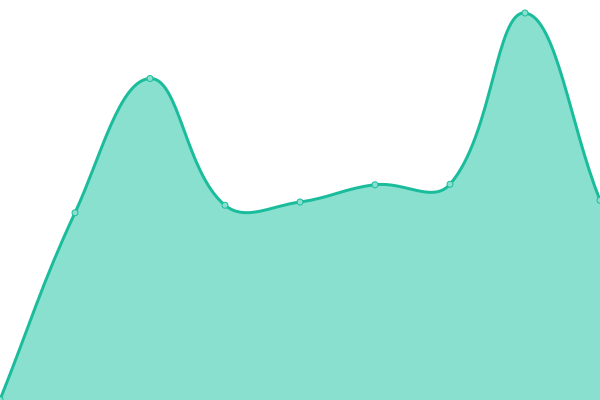
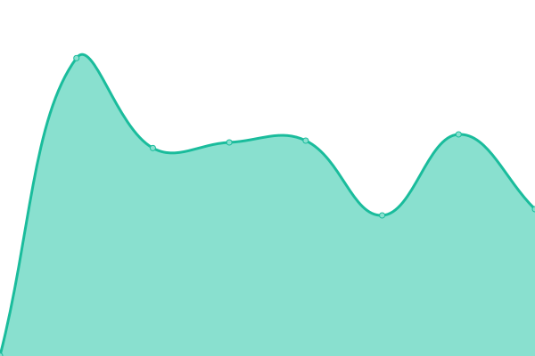

# [📈 Live Status](https://rcpch.github.io/upptime-rcpch-web-services): <!--live status--> **🟧 Partial outage**

This repository contains the open-source uptime monitor and status page for [The Royal College of Paediatrics and Child Health](rcpch.ac.uk), powered by [Upptime](https://github.com/upptime/upptime).

With [Upptime](https://upptime.js.org), you can get your own unlimited and free uptime monitor and status page, powered entirely by a GitHub repository. We use [Issues](https://github.com/rcpch/upptime-rcpch-web-services/issues) as incident reports, [Actions](https://github.com/rcpch/upptime-rcpch-web-services/actions) as uptime monitors, and [Pages](https://rcpch.github.io/upptime-rcpch-web-services) for the status page.

<!--start: status pages-->
<!-- This summary is generated by Upptime (https://github.com/upptime/upptime) -->
<!-- Do not edit this manually, your changes will be overwritten -->
<!-- prettier-ignore -->
| URL | Status | History | Response Time | Uptime |
| --- | ------ | ------- | ------------- | ------ |
|  [Check GET growth.rcpch.ac.uk responds](https://growth.rcpch.ac.uk) | 🟩 Up | [check-get-growth-rcpch-ac-uk-responds.yml](https://github.com/rcpch/upptime-rcpch-web-services/commits/HEAD/history/check-get-growth-rcpch-ac-uk-responds.yml) | 

 637ms
     
 | 

<a href="https://rcpch.github.io/upptime-rcpch-web-services/history/check-get-growth-rcpch-ac-uk-responds">100.00%</a>
    

|  [Check GET dev.rcpch.ac.uk responds](https://dev.rcpch.ac.uk) | 🟩 Up | [check-get-dev-rcpch-ac-uk-responds.yml](https://github.com/rcpch/upptime-rcpch-web-services/commits/HEAD/history/check-get-dev-rcpch-ac-uk-responds.yml) | 

 847ms
     
 | 

<a href="https://rcpch.github.io/upptime-rcpch-web-services/history/check-get-dev-rcpch-ac-uk-responds">100.00%</a>
    

|  [Check GET api.rcpch.ac.uk without Auth returns 401](https://api.rcpch.ac.uk/v1/growth) | 🟥 Down | [check-get-api-rcpch-ac-uk-without-auth-returns-401.yml](https://github.com/rcpch/upptime-rcpch-web-services/commits/HEAD/history/check-get-api-rcpch-ac-uk-without-auth-returns-401.yml) | 

 898ms
     
 | 

<a href="https://rcpch.github.io/upptime-rcpch-web-services/history/check-get-api-rcpch-ac-uk-without-auth-returns-401">100.00%</a>
    

<!--end: status pages-->

[**Visit our status website →**](https://rcpch.github.io/upptime-rcpch-web-services)

## 📄 License

- Powered by: [Upptime](https://github.com/upptime/upptime)
- Code: [MIT](./LICENSE) © [The Royal College of Paediatrics and Child Health](rcpch.ac.uk)
- Data in the `./history` directory: [Open Database License](https://opendatacommons.org/licenses/odbl/1-0/)
